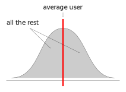
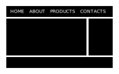

::::slide

::::::::slide
# Accessible code patterns
francesco bedussi

inspired by

[*Inclusive design pattern* by Heydon Pickering](https://www.smashingmagazine.com/inclusive-design-patterns/)
::::

::::slide
# index
- document
- navigation
- (menu) button
- page
- paragraph
- list of products
- filter widget
- registration form
::::

::::slide
:::slide
> unfortunately, we have a habit of overengineering and overcomplicating things
> 
> *Heydon Pickering*
:::

:::slide
> targeting a so-called average user is a disastrus interface design strategy, because average users do not exist
>
> *Heydon Pickering*
:::


:::slide
  
:::
::::

::::slide
# Accessibility, why?

- It involves **a lot of people**: about one fifth (20%) of the population has some kind of disability {fragment}
- An accessible site is also a **search engine friendly site** {fragment}
- **We have to**. Governments (especially USA) are enforcing accessibility by legislation {fragment}
::::

::::slide
# Accessibility, for whom?

- Vision impairments {fragment}
- Limited fine motor control {fragment}
- Cognitive disabilities (rings a bell? :-P ) {fragment}
- Hearing impairments {fragment}
- Older people (ourselves tomorrow) {fragment}
::::

::::slide
# Checklist

- Navigation without mouse
- Navigation without screen
- Content should be visually legible
- Control over automatic changes

::::

::::slide
# patterns vs principles
::::

::::slide
# document
::::

::::slide
# document

:::slide
## the `lang` attribute
- on `html` element, on any inner element
- `:lang(en)` pseudo-class
:::

:::slide
## allow pinch-to-zoom
### don't
````
<meta name="viewport" content="width=device-width, 
initial-scale=1.0, minimum-scale=1.0, 
maximum-scale=1.0, user-scalable=no">
````

### do
````
<meta name="viewport" content="width=device-width, 
   initial-scale=1.0">
````
:::

:::slide
## font sizes
do
````
html {
   font-size: 100%;
}
```` 
don't 
````
html {
    font-size: 16px;
}
````
:::

:::slide
responsive font-size
````
html { font-size: calc(1em + 1vw); }
````
:::

:::slide
## demo
:::

:::slide
Font loading
- [prefer FOUT over FOIT](https://www.zachleat.com/web/comprehensive-webfonts/#fout-class)
- [load web fonts asynchronously](https://github.com/bramstein/fontfaceobserver)
:::

:::slide
- use proper `title` element
- use the `main` element
:::

:::slide
## bonus: print only the main element
````
@media print {
   body > *:not(main) {
       display: none;
   }
}
````
:::

:::slide
## skip to main content
- for sighted keyboard users
````
[href="#main"] {
    position: absolute;
    top: 0;
    right: 100%; /* moves off screen*/
}

[href="#main"]:focus {
    right: auto;
}
````
:::
::::

::::slide
# navigation
::::

::::slide
# navigation

:::slide
- a menu should look like a menu

  
:::

:::slide
- a menu is a `nav` containing an `ul`
- identify the current page link...
- ...but not with color alone
:::

:::slide
## a navigation example
````
<header role="banner">
    <a href="#main">
        
    </a>
    <nav>
        <ul>
            <li><a href="#main">home</a></li>
            <li><a href="/about">about</a></li>
            <li><a href="/products">products</a></li>
        </ul>
    </nav>
</header>
````
:::

:::slide
## table of contents
````
<nav class="toc" aria-labelledby="contents-heading">
    <h2 id="contents-heading">Contents</h2>
    <ul>
        <li><a href="#history">Our history</a></li>
        <li><a href="#services">The services we offer</a></li>
        <li><a href="#office">Visit our office</a></li>
    </ul>
</nav>
````
if you hijack the link to implement smooth scroll don't forget to manage the focus
:::
::::

::::slide
# (menu) button
::::

::::slide
# (menu) button

:::slide
- (hamburger) icon + label + button appearance
- min touch target size: 48x48px
````
<nav aria-label="site">
    <button aria-expanded="false">
        <svg><use xlink:href="#navicon"></use></svg>
        menu
    </button>
    <ul hidden>
        <li><a href="#main">home</a></li>
        <li><a href="/about">about</a></li>
        <li><a href="/products">products</a></li>
    </ul>
</nav>
````
:::
:::slide
critical JS (vanilla, to be included at the end of the page)
````
(function() {
    var button = document.querySelector('[aria-label="site"] button');
    var menu = button.nextElementSibling;

    button.setAttribute('aria-expanded', 'false');
    button.hidden = false;
    menu.hidden = true;
    
    button.addEventListener('click', function() {
        var expanded = this.getAtrtribute('aria-expanded') === 'true';
        this.setAttribute('aria-expanded', String(!expanded));
        menu.hidden = expanded;
    });
})();
````
:::
::::

::::slide
# page
::::

::::slide
# page

:::slide
## headings
- describe nested sections
- one `h1` per page
- never skip a level
- never use a heading for a subtitle
:::

:::slide
## video
- use captions: non-native speakers, for people watching video with audio turned off (e.g. public places), for deaf and hard of hearing
- use keyboard and screen reader accessible players (e.g. YouTube, it provides captions too)
- provide a transcript (linearized version of captions) 
:::
::::

::::slide
# paragraph
::::

::::slide
# paragraph

:::slide
- the ideal length of a line is around 60 characters
`main {max-width: 60rem;}`
- no justification
- line height ~1.5
 
`p { line-height: 1.5; /*unitless!*/}`
- avoid extremely high or extremely low contrast
- keep the standard link style (blue, underlined) whenever possible, eventually improve it
- never ever just remove focus style, eventually replace it
:::

:::slide
## demo
:::

::::

::::slide
# list of products
::::

::::slide
# list of products

:::slide
- code products list as `<ul>`
- use self-governing grid
````
.grid {display: flex; flex-wrap: wrap;}
.grid li {flex-grow: 1; flex-shrink: 1; flex-basis: 10em}
````
:::

:::slide
## demo
:::

:::slide
## key information
group key pieces of information in a definition list:
````
<dl>
    <dt>Size:</dt>
    <dd>90cm x 30xm</dd>
    <dt>Price:</dt>
    <dd>€35.95</dd>
</dl>
````
:::

:::slide
## images
- provide `alt` text only if it adds meaning 
- optimize & lazy load images
:::

:::slide
## cta
- if the cta is a link do not style it as a button...
- ...but use some visual clue (e.g. color) common to links, buttons, ctas to indicate their interactivity
- if cta is a link style it using tag + class selector, e.g. `a.call-to-action`
- [buttons do not have an hand cursor](https://medium.com/simple-human/buttons-shouldnt-have-a-hand-cursor-b11e99ca374b)
- include the product name, eventually visually hidden, in the cta label
:::

:::slide
## avoid link wrapping product block
- it doesn't have a dedicated label
- produces unexpected behavior in some screen readers
- on touch device it can be pressed accidentally
:::

:::slide
## use microdata to enhance SERP
````
<main id="main" itemscope itemtype="http://schema.org/Product">
    <h1>
        <span itemprop="name">Naked man in garage forecourt</span>
        <a href="/artist/kenny-mulbarton">by Kenny Mulbarton</a>
    </h1>
    
    <dl>
        <dt>Size: </dt>
        <dd>90cm &times; 30cm</dd>
        <dt>Price: </dt>
        <dd> 
            <span itemprop="offers" itemscope itemtype="http://schema.org/Offer">
                <meta itemprop="priceCurrency" content="EUR" />
                €<span itemprop="price">35.95</span>
            </span>
        </dd>
        <dt>Rating: </dt>
        <dd>
            
            <span itemprop="aggregateRating" itemscope itemtype="http://schema.org/AggregateRating">
                <span itemprop="ratingValue">4</span> stars, based on <span itemprop="reviewCount">13</span> reviews
            </span>
        </dd>
        
    </dl>
    <h2>Choose a payment method</h2>
    <!-- ... -->
</main>
````
:::

:::slide
## loading more results
- avoid infinite scroll
- prefer a "load more" button
- remember to manage focus
- and to communicate that the loading is in progress
:::

:::slide
1. click on "load more"
2. the button is disabled and its label changed in "loading"
3. a hidden live region announces "loading more products"
4. the request is handled
5. on success the content is rendered
6. the live region announces "products loaded"
7. focus is moved to the first of the new products
8. the "load more" button reverts to its original status
:::

::::

::::slide
# a filter widget
::::

::::slide
# a filter widget

:::slide
- leverage HTML behavior 
- visually hide radio buttons and style labels based on radio buttons status
- use live regions to communicate that the content is being fetched
- do not remove the submit button
:::

:::slide
## demo
:::

::::

::::slide
# a registration form
::::

::::slide
# a registration form

:::slide
## login/register toolbar
````
<h1>Welcome</h1>
    <div role="toolbar" aria-label="login or register">
        <button aria-pressed="true">Login</button>
        <button aria-pressed="false">Register</button>
    </div>
    <div id="forms">
        <div id="login">
            <form>
                <!-- login form -->
            </form>
        </div>

        <div id="register">
            <form>
                <!-- registration form -->
            </form>
        </div>
    </div>
````
:::

:::slide
- USE LABELS!!!
- placeholders are not labels, they are hints on how to fill in the field
:::

:::slide
- `<fieldset>` are pointless without `<legend>`
- use `aria-required="true"` and prefer it over `required` html attribute
- give the possibility to show password
- mark error message containers as `aria-live="assertive"`
- use `aria-invalid="true"` on field that do not pass the validation (it can be used as a CSS selector as well)
- provide a hint on why the field is invalid
:::

::::

::::slide
let your code speak for itself 
::::


